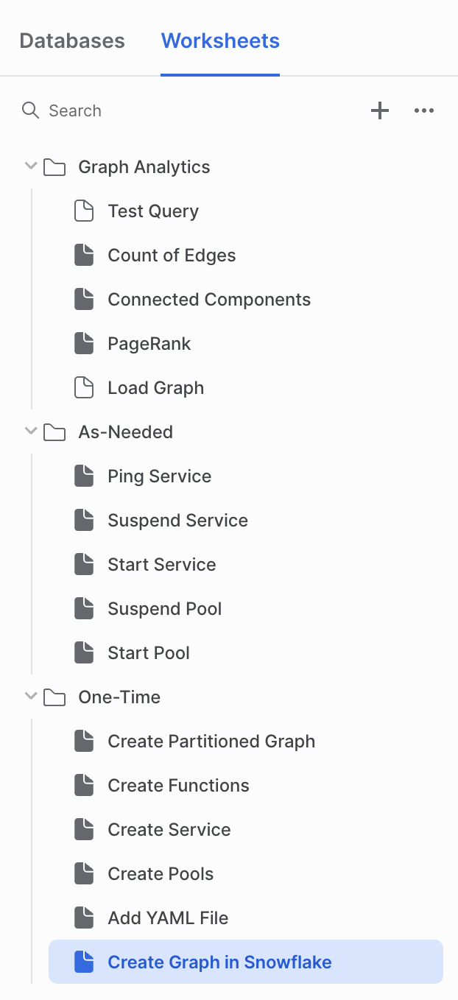

# rai_sfcs_demo
Relational AI and Snowflake Container Services Demo

### Instructions:

Follow along with the snowpark containers [tutorial 1](https://docs.snowflake.com/en/LIMITEDACCESS/snowpark-containers/tutorials/tutorial-1), altering the instructions to use the RAI images.

Edit rai_service_spec.yaml file by changing the locations of the rai-server and rai-proxy docker image locations:

	xxxxx-xxxxx-snowservices.registry.snowflakecomputing.com/rai_repository/rai-server:release
	xxxxx-xxxxx-snowservices.registry.snowflakecomputing.com/rai_repository/rai-proxy:release
	
Edit one_time/add_yaml_file.sql by replacing the physical location of the yaml file:

	put file:///Users/max/demo/rai_service_spec.yaml 
		

Worksheets should look something like this:

